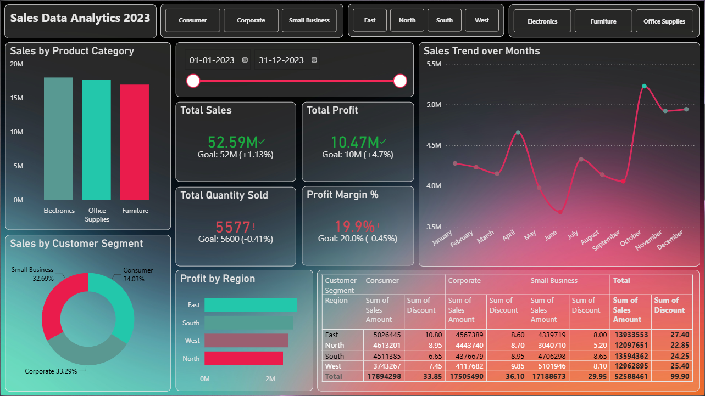

# Sales Performance Analytics Dashboard

## Overview
This Power BI dashboard analyzes sales performance across products, customer segments, and regions.

## Features
- KPI Cards (Sales, Profit, Quantity Sold)
- Monthly Sales Trend Analysis
- Sales by Product Category
- Profit by Region
- Customer Segment Analysis
- Interactive Filters and Slicers

## Tools Used
- Power BI
- DAX
- Power Query
- Data Modeling

## Dashboard Preview

## Key Insights
- Identified top-performing regions.
- Analyzed monthly sales trends.
- Compared customer segment contributions.
- Monitored business KPIs.

## Author
Prathmesh Tamboli
